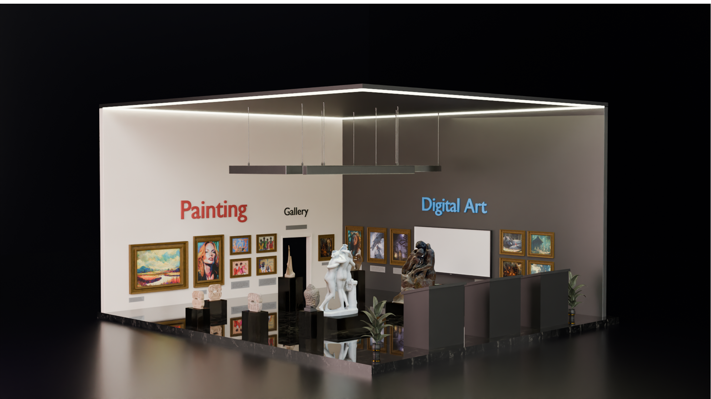

# Art Gallery

An interactive 3D exhibition you walk through in the browser — no headset or install required.

## What it is

A WebGL/WebXR art gallery built with A-Frame. Visitors move through a 3D exhibition space, get proximity-triggered audio narration as they approach pieces, and can interact with objects in the room — right from a browser tab, on desktop or a WebXR-capable headset.

## Key features

- **Free-roam 3D navigation** with collision handling so visitors can't walk through walls or exhibits.
- **Proximity narration** — audio guides that trigger automatically as a visitor approaches an exhibit.
- **Interactive elements** — clickable objects (including an in-scene quiz screen) that respond to visitor input.
- **WebXR-ready** — runs in a standard browser and upgrades to immersive VR mode on supported headsets.

## Tech stack

- **Framework:** [A-Frame](https://aframe.io/) 1.5.0 (WebGL/WebXR)
- **Language:** JavaScript, HTML
- **Assets:** custom 3D models, audio narration, textures

## Running it locally

This is a static site — no build step required.

```bash
# from the project folder
npx serve .
```

Then open the local URL it prints in your browser.

## Screenshot


